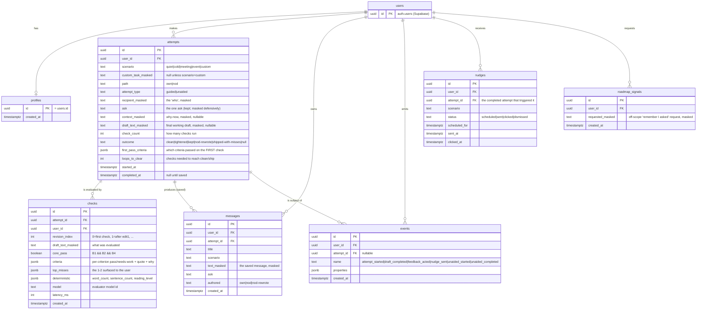

# NOD — v1 Data Model (ERD)

**Status:** build spec · **Paired with:** `implementation.md` (the build), `v1PRD.md` §14/§16 (events + rubric), `journey.md` (the flow).
**Stack:** Supabase Postgres. Every table has Row-Level Security ON, scoped to the signed-in user.

> Read `implementation.md` Phase 1 to apply this. This file is the **authority on the schema**; the SQL at
> the bottom is the migration to run verbatim.

---

## The masking invariant (READ FIRST — non-negotiable, Decision 9 / PRD §16)

**No raw recipient name or company identifier is ever stored or sent to the model.** Masking happens
**client-side, before any network request.** The database *cannot* hold raw PII because the app never
transmits it.

- The user's real recipient name lives **only in the browser** (localStorage), used solely to render
  *their* draft and to fill the name back in at **copy-to-send**.
- Everything persisted or sent to the evaluator is already masked (`[name]`, `[company]`, …).
- Consequence for this schema: every free-text column that could contain an identifier is suffixed
  `_masked` and is a masked string by construction. There is no "raw" counterpart column anywhere.

---

## Entities & relationships



### What each table is for
- **profiles** — one row per user (created on first sign-in via trigger). A hook for future profile data;
  minimal in v1.
- **attempts** — the unit of work: one outreach message the user is drafting. `attempt_type` distinguishes
  the guided first attempt from a later `unaided` re-attempt (the North-Star comparison, PRD §8).
  `first_pass_criteria` + `loops_to_clear` are the **capability signal** (PRD §16 — the cleaner within-draft
  read).
- **checks** — one row per evaluator run. This is the audit trail of the coaching loop and the raw material
  for `draft_completed.rubric_pass` and the delta. Stores per-criterion results incl. the exact quote the
  model reacted to.
- **messages** — the saved artifact (the portfolio, Decision 5). `authored` feeds the independence trend
  (Decision 11): did the user write it, react to a NOD draft, or did NOD rewrite it after two tries.
- **events** — the PRD §14 instrumentation. The instrumentation *is* the experiment; keep names exact.
- **nudges** — the single outcome-tied re-engagement per completed attempt (Decision 10). v1 may just
  render the nudge in-app on return; the table lets us instrument it either way.
- **roadmap_signals** — the off-scope "want me to remember you asked for this?" capture (PRD §13).

---

## Enumerated values (keep in sync with the app + `flow.js`)
- `attempts.scenario`: `quiet | cold | meeting | event | custom`
- `attempts.path`: `own | nod`
- `attempts.attempt_type`: `guided | unaided`
- `attempts.outcome`: `clean | tightened | kept | nod-rewrote | shipped-with-misses`
- `messages.authored`: `own | nod | nod-rewrote`
- `events.name`: `attempt_started | draft_completed | feedback_acted | nudge_sent | unaided_started | unaided_completed`
- `criteria` keys (in `checks.criteria`): `b1, b2, b3, b4, b5` each `{ pass: boolean, quote: string|null, why: string|null }`; plus `personalized: [{ id, pass, quote, why }]`. `b4` also carries `{ word_count, sentence_count, reading_level }`.

---

## The migration (run verbatim — Supabase SQL editor or `supabase/migrations/0001_init.sql`)

```sql
-- 0001_init.sql — NOD v1 schema. RLS on every table, scoped to auth.uid().

create extension if not exists pgcrypto;

-- profiles: 1:1 with auth.users, created on signup
create table public.profiles (
  id uuid primary key references auth.users(id) on delete cascade,
  created_at timestamptz not null default now()
);

create table public.attempts (
  id uuid primary key default gen_random_uuid(),
  user_id uuid not null references auth.users(id) on delete cascade,
  scenario text not null check (scenario in ('quiet','cold','meeting','event','custom')),
  custom_task_masked text,
  path text not null default 'own' check (path in ('own','nod')),
  attempt_type text not null default 'guided' check (attempt_type in ('guided','unaided')),
  recipient_masked text,
  ask text,
  context_masked text,
  draft_text_masked text,
  check_count int not null default 0,
  outcome text check (outcome in ('clean','tightened','kept','nod-rewrote','shipped-with-misses')),
  first_pass_criteria jsonb,
  loops_to_clear int,
  started_at timestamptz not null default now(),
  completed_at timestamptz
);
create index attempts_user_idx on public.attempts(user_id, started_at desc);

create table public.checks (
  id uuid primary key default gen_random_uuid(),
  attempt_id uuid not null references public.attempts(id) on delete cascade,
  user_id uuid not null references auth.users(id) on delete cascade,
  revision_index int not null default 0,
  draft_text_masked text not null,
  core_pass boolean not null,
  criteria jsonb not null,
  top_misses jsonb,
  deterministic jsonb,
  model text,
  latency_ms int,
  created_at timestamptz not null default now()
);
create index checks_attempt_idx on public.checks(attempt_id, revision_index);

create table public.messages (
  id uuid primary key default gen_random_uuid(),
  user_id uuid not null references auth.users(id) on delete cascade,
  attempt_id uuid references public.attempts(id) on delete set null,
  title text not null,
  scenario text not null,
  text_masked text not null,
  ask text,
  authored text not null default 'own' check (authored in ('own','nod','nod-rewrote')),
  created_at timestamptz not null default now()
);
create index messages_user_idx on public.messages(user_id, created_at desc);

create table public.events (
  id uuid primary key default gen_random_uuid(),
  user_id uuid not null references auth.users(id) on delete cascade,
  attempt_id uuid references public.attempts(id) on delete set null,
  name text not null check (name in
    ('attempt_started','draft_completed','feedback_acted','nudge_sent','unaided_started','unaided_completed')),
  properties jsonb not null default '{}',
  created_at timestamptz not null default now()
);
create index events_user_idx on public.events(user_id, created_at desc);

create table public.nudges (
  id uuid primary key default gen_random_uuid(),
  user_id uuid not null references auth.users(id) on delete cascade,
  attempt_id uuid references public.attempts(id) on delete set null,
  scenario text not null,
  status text not null default 'scheduled' check (status in ('scheduled','sent','clicked','dismissed')),
  scheduled_for timestamptz,
  sent_at timestamptz,
  clicked_at timestamptz
);

create table public.roadmap_signals (
  id uuid primary key default gen_random_uuid(),
  user_id uuid not null references auth.users(id) on delete cascade,
  requested_masked text not null,
  created_at timestamptz not null default now()
);

-- Row-Level Security: a user can only touch their own rows.
alter table public.profiles       enable row level security;
alter table public.attempts       enable row level security;
alter table public.checks         enable row level security;
alter table public.messages       enable row level security;
alter table public.events         enable row level security;
alter table public.nudges         enable row level security;
alter table public.roadmap_signals enable row level security;

-- profiles: self only
create policy "profiles self" on public.profiles
  for all using (auth.uid() = id) with check (auth.uid() = id);

-- one owner policy per user-scoped table (select/insert/update/delete)
create policy "attempts owner" on public.attempts
  for all using (auth.uid() = user_id) with check (auth.uid() = user_id);
create policy "checks owner" on public.checks
  for all using (auth.uid() = user_id) with check (auth.uid() = user_id);
create policy "messages owner" on public.messages
  for all using (auth.uid() = user_id) with check (auth.uid() = user_id);
create policy "events owner" on public.events
  for all using (auth.uid() = user_id) with check (auth.uid() = user_id);
create policy "nudges owner" on public.nudges
  for all using (auth.uid() = user_id) with check (auth.uid() = user_id);
create policy "roadmap owner" on public.roadmap_signals
  for all using (auth.uid() = user_id) with check (auth.uid() = user_id);

-- auto-create a profile row on signup
create or replace function public.handle_new_user()
returns trigger language plpgsql security definer set search_path = '' as $$
begin
  insert into public.profiles (id) values (new.id) on conflict do nothing;
  return new;
end; $$;
revoke execute on function public.handle_new_user() from anon, authenticated;

create trigger on_auth_user_created
  after insert on auth.users
  for each row execute function public.handle_new_user();
```

> **Security note (Supabase advisor):** `security definer` functions must not be executable by `anon`
> — hence the explicit `revoke`. Do not grant execute to `anon`/`authenticated`.

---

## Notes for the build
- **Writes go through server routes**, not the browser client, so masking + validation are enforced server
  side too (defense in depth — the client already masked, the server refuses anything that still looks like
  raw PII for the known recipient token). See `implementation.md` Phase 5.
- Keep `flow.js`'s scenario ids (`quiet/cold/meeting/event/custom`) as the `scenario` enum — they must match.
- `checks.criteria` is the source of truth for the capability read; never discard a check row.
