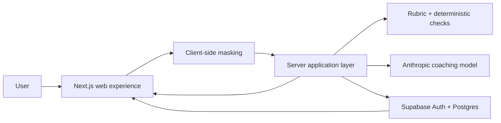

# NOD — Platform Architecture

## Purpose

NOD is a focused AI capability coach for non-technical marketing and sales professionals. The platform helps a user complete one real outreach task, improve it through feedback, save the result, and later try a similar task independently.

## Basic shape

NOD has five main parts:

1. **Web experience** — the screens where the user chooses a situation, adds context, writes a draft, receives feedback, revises it, and views saved messages.
2. **Application layer** — the server-side part that manages the coaching flow, validates requests, controls access, and coordinates the evaluator and database.
3. **AI coaching and evaluation** — an Anthropic model provides plain-language coaching and, when necessary, a better example. A fixed rubric and deterministic checks keep the feedback anchored to the outreach standard.
4. **User data and progress store** — Supabase stores the signed-in user, masked attempts, feedback checks, saved artefacts, events, and outcome-tied nudges.
5. **Authentication and privacy controls** — Supabase Auth manages sign-in, while masking and row-level security protect user data.

## How the pieces work together

### 1. User starts a task

The user signs in and chooses an outreach situation. They describe the audience, goal, offer, channel, and any useful context in plain language. NOD structures this into a task brief and asks only for important missing information.

### 2. User writes first

The default path asks the user to write their own draft. If they are stuck, NOD can provide a hint or an alternative draft to react to, but the user’s own text remains central to the coaching loop.

### 3. Text is protected before it leaves the browser

The client masks known names, emails, company identifiers, and similar personal information before sending text to the server. The server repeats safety checks and does not store the unmasked draft.

### 4. The server evaluates the draft

The application sends the masked task context and draft to the evaluator. Deterministic checks handle measurable signals such as length and structure. The server-side Anthropic call judges the more contextual qualities, such as relevance, clarity, personalisation, tone, and the strength of the ask. The evaluator returns one or two highest-impact improvements in plain language.

### 5. User revises and saves

The user decides what to change and submits a revision. NOD rechecks it, shows what improved, and saves the masked original, revision, feedback, and learning point as a reusable artefact. It does not present a grade or score.

### 6. NOD supports later retrieval and independence

On a later visit, NOD can show a saved message or an outcome-tied nudge. The user can start a similar unaided attempt. The system records the attempt and compares useful capability signals such as help requests, AI turns, time to completion, and rubric quality.

## Main data boundaries

| Boundary | Responsibility |
|---|---|
| Browser/client | Collects task input, masks identifiable text, and presents the flow. |
| Server/application | Authenticates requests, applies business rules, calls the evaluator, and writes approved records. |
| AI provider | Provides coaching and contextual judgement using only the masked payload sent by the server. |
| Supabase | Provides authentication, persistent storage, and row-level access control. |
| User | Owns the final wording and decides which feedback to accept. |

## Permanent constraints

- **Privacy by design:** raw personally identifiable information must not be sent to the AI provider or stored in the database. Masking is silent and happens before a network request, with a brief reassurance in the interface.
- **Server-owned AI calls:** API keys and model calls must remain on the server; they must never be exposed in browser code.
- **User-level isolation:** every user-owned table uses Supabase row-level security so a signed-in user can access only their own records.
- **Feedback, not grading:** NOD must not show scores, grades, pass/fail colours, or a checklist that turns coaching into a test. It should give one or two concrete improvements tied to the fixed standard.
- **User-authored capability:** the default flow must preserve the user’s own attempt. Full AI-generated answers are an escape hatch, not the primary learning path.
- **Quality claims only:** NOD can say that a message is stronger against the defined expert standard; it cannot promise replies, conversions, or other external business outcomes.
- **English-only v1:** the first release supports English copy and evaluation only.
- **Model dependency:** coaching quality, latency, availability, and cost depend on the selected Anthropic model. The application must handle provider errors without losing the user’s draft.
- **Limited v1 re-engagement:** nudges are in-app and tied to a real next occurrence; email and streak mechanics are outside the initial architecture.
- **No silent data expansion:** future integrations, team features, analytics, and broader task types must not be added until the core outreach practice loop is validated.

## In one sentence

NOD is a privacy-first web application in which a masked, user-authored outreach draft moves through a server-controlled rubric and AI coaching service, is stored as a reusable learning artefact, and later becomes the baseline for an unaided practice attempt.
